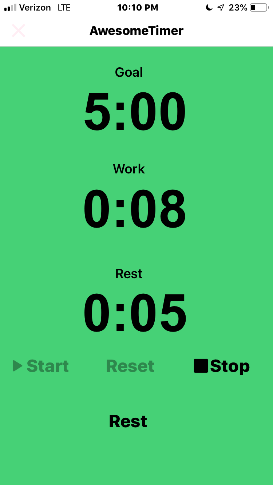

# Accumulate Timer

Simple timer app for iOS to accumulate a certain amount of time doing a task. I created this for workouts--specifically, timing a certain amount of time in a plank position.  You can pause the timer then restart until you reach the goal time.

## Getting Started

Copy the files to [Pythonista](http://omz-software.com/pythonista/) and run Accum.py

### Prerequisites

[Pythonista](http://omz-software.com/pythonista/) python IDE for iOS.  If you own an iOS device and you code in python, you need this app!

### Installing

The easiest way to get the files into Pythonista is to clone this repository with [Working Copy](https://workingcopyapp.com) iOS git client.

## Built With

* [Pythonista](http://omz-software.com/pythonista/) 

## Authors

* **Rhet Turnbull** 

## License

This project is licensed under the MIT License - see the [LICENSE.md](LICENSE.md) file for details

